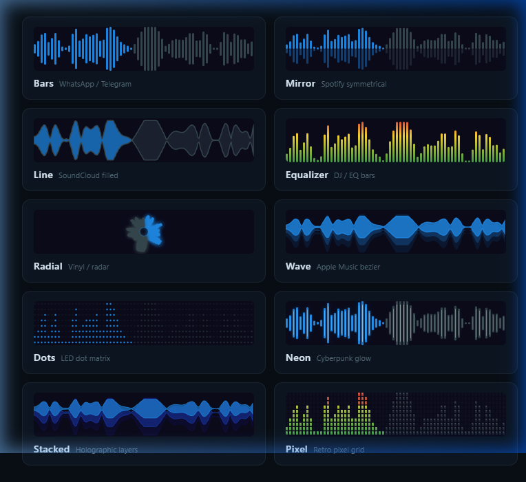

<div align="center">
  <h1>🎙️ Audio Waveform Recorder</h1>
  
  <p><strong>Record audio with a real-time animated waveform and play it back with waveform scrubbing.</strong></p>
  
  <p>
    <a href="https://pub.dev/packages/audio_waveform_recorder"></a>
    <a href="https://pub.dev/packages/audio_waveform_recorder"></a>
    <a href="https://opensource.org/licenses/MIT"></a>
  </p>

  <p>
    <em>Zero heavy dependencies. Pure Dart UI + Native Platform Channels.</em>
  </p>
</div>

---

## 🎨 10 Exquisite Waveform Styles

Choose from beautifully crafted, highly customizable 60fps waveform animations.

<p align="center">
  
</p>

| Style | Description | Vibe |
|:---:|:---|:---|
| **Bars** | Classic centre-aligned bars | *WhatsApp / Telegram* |
| **Mirror** | Symmetrical mirror bars, top + bottom | *Spotify* |
| **Line** | Filled closed-path shape | *SoundCloud* |
| **Equalizer** | Bottom-anchored histogram bars | *DJ / EQ* |
| **Radial** | Circular radial bars from centre | *Vinyl / Radar* |
| **Wave** | Smooth cubic-bezier with gradient layers | *Apple Music* |
| **Dots** | Dot matrix, amplitude mapped to dot radius | *Retro LED / Nothing OS* |
| **Neon** | Glowing bars with bloom shadow | *Cyberpunk* |
| **Stacked** | Semi-transparent layers with depth | *Holographic* |
| **Pixel** | Pixel-art blocky cells on a grid | *Retro 8-bit / Arcade* |

---

## ✨ Supercharged Features

*   🎙️ **Real-Time Visuals** — Animated bars that respond instantly to your voice.
*   ▶️ **Interactive Scrubbing** — Tap, drag, or scrub through the waveform seamlessly.
*   🔴 **Pulsing Indicator** — A sleek, animated recording dot.
*   ⏸️ **Pause & Resume** — Perfect control over your recording sessions.
*   ⏭️ **Speed Control** — Adjust playback speed seamlessly from `0.5x` to `2.0x`.
*   📊 **Instant Extraction** — Generate waveforms from existing local audio files.
*   💾 **Multiple Formats** — Export to `M4A`, `WAV`, `MP4`, or `OGG`.
*   🔕 **Smart Silence Detection** — Configurable timeout to automatically stop recording when it goes quiet.
*   ⏱️ **Built-in Limits** — Optional max-duration limit with UI indicators.
*   🎛️ **Pixel-Perfect Customization** — Tweak colors, gradients, glow radii, gaps, and rounding.

---

## 🚀 Getting Started

### 1. Add Dependency

Add the package to your `pubspec.yaml`:

```yaml
dependencies:
  audio_waveform_recorder: ^0.1.0
```

### 2. Configure Permissions

<details>
<summary><b>Android Setup</b></summary>
<br>

Add the following to your `android/app/src/main/AndroidManifest.xml`:

```xml
<uses-permission android:name="android.permission.RECORD_AUDIO"/>
<uses-permission android:name="android.permission.WRITE_EXTERNAL_STORAGE"/>
```
</details>

<details>
<summary><b>iOS Setup</b></summary>
<br>

Add the following to your `ios/Runner/Info.plist`:

```xml
<key>NSMicrophoneUsageDescription</key>
<string>This app needs microphone access to record awesome audio messages.</string>
```
</details>

---

## 📱 Quick Usage

The simplest way to use the package is with the drop-in, plug-and-play widgets.

### 🎙️ The Recorder Widget

```dart
WaveformRecorderWidget(
  config: RecorderConfig(
    format: AudioFormat.m4a,
    maxDuration: const Duration(minutes: 5),
    recordingColor: Colors.redAccent,
    playedColor: Colors.blueAccent,
  ),
  style: WaveformStyle.neon, // Try different styles here!
  onRecordingComplete: (RecordingResult result) {
    debugPrint('🎉 Saved at: ${result.filePath}');
    debugPrint('⏳ Duration: ${result.duration}');
  },
)
```

### ▶️ The Player Widget

Pass the waveform extracted during recording for instant visual playback.

```dart
WaveformPlayerWidget(
  filePath: result.filePath,
  waveform: result.waveform,
  config: RecorderConfig(
    playedColor: Colors.blue,
    idleColor: Colors.grey.withValues(alpha: 0.3),
  ),
  showSpeedControl: true,
)
```

### 🎛️ Need Manual Control?

Use `RecorderController` to build your entirely custom UI while we handle the engine.

```dart
final controller = RecorderController(
  config: RecorderConfig(format: AudioFormat.wav),
);

// 1. Request permission
await controller.requestPermission();

// 2. Start / Pause / Resume
await controller.start();
await controller.pause();
await controller.resume();

// 3. Stop and grab the file + waveform data
final result = await controller.stop();

// 4. Or cancel (automatically deletes the file)
await controller.cancel();
```

---

## ⚙️ Advanced Configuration

Tweak every single visual aspect.

```dart
RecorderConfig(
  // Audio Settings
  format:           AudioFormat.m4a,       // m4a, wav, mp4, ogg
  sampleRate:       SampleRate.high44k,    // 8k, 16k, 44.1k, 48k
  bitRate:          BitRate.medium128k,    // 64k, 128k, 256k
  channels:         1,                     // 1=Mono, 2=Stereo
  maxDuration:      const Duration(minutes: 5),
  silenceTimeout:   const Duration(seconds: 3),
  
  // Base Visuals
  waveformSampleRate:  100,                  
  recordingColor:      Colors.redAccent,
  idleColor:           Colors.grey,
  playedColor:         Colors.blueAccent,
  barWidth:            4.0,
  barGap:              2.5,
  barBorderRadius:     4.0,
)
```

### 💫 Style-Specific Customization

Unlock the full power of each visual style using `WaveformStyleConfig`.

```dart
WaveformStyleConfig(
  // Gradients
  useGradient: true,
  gradientColors: [Colors.orange, Colors.red],
  
  // Neon Glow Effects
  glowRadius: 10.0,
  glowLayers: 3,
  
  // Radial (Circular) Settings
  radialInnerFraction: 0.3,
  radialRoundedTips: true,
  
  // Wave Layers
  waveLayerCount: 3,
  waveLayerOffset: 0.1,
  
  // Retro Pixel & Dots
  pixelRows: 12,
  dotFilled: true,
  
  // Mirror Opacity
  mirrorReflectionOpacity: 0.3,
)
```

---

## 🏗️ Architecture Under The Hood

```ascii
WaveformRecorderWidget          WaveformPlayerWidget
       │                               │
RecorderController              PlayerController
       │                               │
  AudioChannel (MethodChannel: "audio_waveform_recorder")
       │                               │
  Android: MediaRecorder          Android: MediaPlayer
           MediaExtractor                   + MediaCodec
  iOS:     AVAudioRecorder        iOS:     AVAudioPlayer
           AVAudioFile                      + AVFoundation
```

---

## 🤝 Contributing & License

We love pull requests! If you have an idea for a new waveform style or feature, feel free to open an issue or PR.

Distributed under the **MIT License**. Built with ❤️ by pure Dart UI perfectionists.
